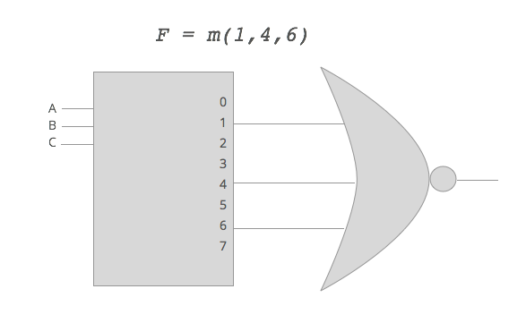

Lecture 14
==========

*Oct 23*

Today, we started Chapter 4. The midterm was held last Tuesday.

Now, we will build an **n to m** line decoder. For example, there are 1 to 2 line decoders, and 2 to 4 line decoders. Their purpose in to generate *minterms*. See their implementation in the lecture slides.

How would be get maxterms instead of minterms? Well, in the decoders implementation, just **swap the `AND` gates for `OR` gates**. It's as simple as that. If this doesn't make sense, revisit the relationship between minterms and maxterms.

Two ways of decoder expansion: internal and expansion (internal means changing the gates on the inside, external means adding gates). From now on, we will represent decoders as **blocks**. It literally just a rectangualr block that says what type of decoder it is. A 2 to 4 line decoder would have two inputs denoted by `A1` and `A0`, a third input denoted by `E`, for your **enable**. And four outputs (`m0, m1, m2, m3` which are just minterms.)

Example: 3 to 8 line decoder for generating `F = m(1,4,6)`.

######On assignments/exam: never write the internal design, just use the block diagram (UNLESS SPECIFICALLY ASKED TO DESIGN THE DECODER).

What is an **encoder**?

It does the opposite encoding: you put in minterms (or maxterms, or whatever) and you get out 1's and 0's (you get the binary code generated by the input).

Priority Encoder: if more than one input in a regular encoder is equal to 1, then the circuit won't work. A priority encoder solves that problem.

######Quiz next Thursday.
