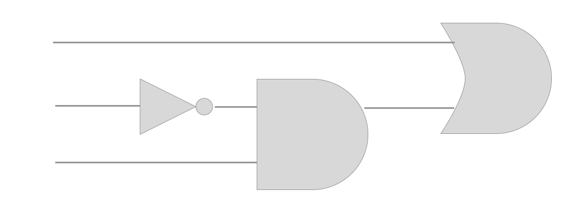

Lecture 1
=========

*Sep 9*

Unit conversions -- radix 10 to 2, etc.

*Sep 11*

######Example: Convert 46 radix 10 to radix 4
```
46/4 = 11 + 2
11/4 = 8 + 3
 8/4 = 0 + 2	// Done
```

The result is **232**.

The only bases we really care about in this course are 2 (binary), 8 (octal), 10 (decimal), and 16 (hex). Remeber that hex goes from 1 - F, (1,2,3,4,5,6,7,8,9,A,B,C,D,E,F, in case you forgot).

######Example: Convert octal to binary to hex

Start with 635.177 radix 8, then convert to binary:
```
635.177		// Just start at the left and convert each number ti binary. You need 3 digits in binary to represent one digit in octal, since 2^3 = 8
6       = 110
 3      = 011
  5     = 110
   .1   = 001
     7  = 111
      7 = 111	// The number in binary is...
110011110.001111111
```
Once you've got the number in binary, convert to hex. Remember that `2^4 = 16`, so you need **four** binary digits to represent **one** hexadeciaml digit. 
```
// Start from the decimal, and go left
1110 = D
1001 = 9
0001 = 1	// You can add zeros on the left (and right) of the number as much as you want, since it doesn't change the value of the number)
// Now go from the right of the decimal
0011 = 3
1111 = F
1000 = 8
```
The result is `D91.3F8`.

####Binary Codes for Decimal Digits
There are a bunch of ways to show 1 - 10 in binary (over 8000 or something... but never *over 9000*). The normal one goes 0, 1, 10, 11, 100, etc. BUt there are also a few other popular ones.

######Excess-3
Start at 0011, go up from there.

######8,4,-2,-1
0000, 0111, 0110, 0101, 0100, 1011, etc. This one isn't so popular. You just Start at 0000, go to 0111, and basically count backwards from there.

######BCD
BDC = Binary Coded Decimal. This is just the one we're used to, nothing special here.

######Gray Code
This one is weird, but the point of it was to only change one bit at a time when incrementing. It's kind of genius, but we'll look at it later.

The guy at the front of the room is yelling about how we need to be careful not to mix up *conversion* and *coding*. *Conversion* is when you take a number in, say, decimal, and then convert it to binary, ie `15 = 1111`. *Coding* is taking each digit and putting that digit in binary, ie `15 = 001|100`. Don't mess up.

####Arithmetic
How do you add, subtract, and multiply (we're too dumb for division I guess)? You just do it like a normal human would:

What's 1 + 0 (we're talking addition of two binary numbers)? 
```
	1
+	0
=	1
```

That's pretty basic, here's a better one:
```
	01100
+	10001
=	11101
```
That was also easy, since we didn't have a carry. Here's a simple one with a carry:
```
	011
+	101
=      1000
```

######Subtraction
Subtraction is also easy, instead of adding the carry, you just borrow it. It's just like the way you learned in elementary school doing decimal subtraction.
```
	10110
-	10011
=	00011
```

A good thing you can do if you want is to convert the number to decimals and do the calculation that way to check your answer.

######Multiplication

This is the binary multiplication table:

`0 * 0 = 0`, `1 * 0 = 0`, `0 * 1 = 0`, `1 * 1 = 0`.

Binary multiplication is incredibly easy once you know the table. To mutiply two binary numbers, follow my stupid picture:

Lecture 3
=========

*Sep 16*

Binary division:
```
101 / 1101101.101
      101
      00111
        101
         1001
          101
          100.1
           10.1
           10.00
            1.01
            1.000
              101
              111
```
This doesn't seem like it's going to be to important, since it wasn't covered last year or covered in any detail here. **Next Lecture, an assignment will be handed out and a quiz happen** (covering this chapter). So just review conversion and simple arithmetic.

####Chapter 2

#######Part 1: Gate Circuits and Boolean Equations

The basic logic operators are `AND`, `OR`, and `NOT`. 

######Basic Truth Tables

| AND (・) |  |     |
| ---- | ---- | --- |
| 0    | 0    | 0   |
| 0    | 1    | 0   |
| 1    | 0    | 0   |
| 1    | 1    | 1   |

| OR (+) |    |     |
| ---- | ---- | --- |
| 0    | 0    | 0   |
| 0    | 1    | 1   |
| 1    | 0    | 1   |
| 1    | 1    | 1   |

*Our goal* is to design hardware that can perform any logical or mathematical operation, while trying to make the simplest possible equation (in the real world, smaller = cheaper and more environmentally friendly).

######Logic Diagrams
Here's `F = X + ¬YZ`



######Boolean Algebra
There are *17* commonly used boolean formulas. Just add that image into this document.

Lecture 5
=========

Example:
```
ACD' + C'D' + (A'C')'
= D'(AC + C') + A + C
= D'((A + C')(C + C')) + A + C
= AD' + C'D' + A + C
= A(1 + D') + (C + C')(C + D')
= A + C + D'
```

This was a question on a quiz. These questions are pretty easy *if* you know all the laws that make simplification easier (like DeMorgan's Law, etc).

####Canonical Forms
This is the part of the unit where we learn about minterms and maxterms, sum-of-minterms representations, product-of-maxterm representations, representation of complements of functions, and conversions between representations.

######Maxterms/Minterms
I don't know how to explain this without just showing an example:

| A    | B    | C   | Minterms     | Maxterms   |
| ---- | ---- | --- | ------------ | ---------- |
| 0    | 0    | 0   | (A')(B')(C') | A + B + C  |
| 0    | 0    | 1   | (A')(B')(C)  | A + B + C' |
| 0    | 1    | 0   | (A')(B)(C)'  | A + B' + C |

Maxterms are **OR** terms with every variable in **true** or complemented form.
Minterms are **AND** terms with every variable in **false** or complemented form.

How would you represent minterms number 4? (m<sub>6</sub>)

Well, the sixth row of the truth table for XYZ would be,
| X    | Y    | Z   |
| ---- | ---- | --- |
| 0    | 0    | 0   |
| 0    | 0    | 1   |
| 0    | 1    | 0   |
| 0    | 1    | 1   |
(etc)

It would be equal to (A')(B)(C) *(minterm)* or A + B' + C' *(maxterm)*. As you might've just realized. The relationship between minterms and maxterms is just DeMorgan's Law.

At this point, there are a ton of tables in the slides, so you'd be better off referring to those.

######Minterm Function Example
Find `F1 = m1 + m4 + m7`:

`F = X'Y'Z + XY'Z' + XYZ`

If you wanted the **Product of Maxterms** (which would've been denoted `F1 = (M2)(M3)(M5)(M6)`), it would just be:
`F = (X + Y' + Z)(X' + Y + Z)(X' + Y' + Z)(X' + Y + Z')(X' + Y' + Z )`

Finding the SOM and POM is basically the opposite of what we learned last week. This is expansion, instead of simplification.

Why would anyone even want to find the SOM or POM? This is the *short form* of a function (since it's expressed easily). This encourgaes modularity and reusability in logic design.
