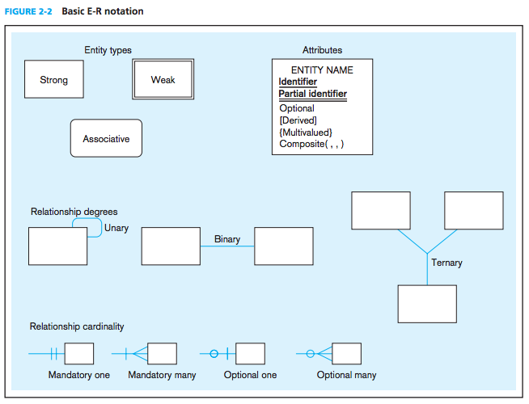

##Studying

*Data Models*: capture the nature and relationships among data
*Entities*: object which contains business information, ie: customers, orders, etc
*Relationships*: relationships are between entities, ie: an order belongs to a customer
*Metadata*: data descriptions

######Relational Databases
These stablish relationships between entities by means of common fields. This is a **relation**. For example, a customer places an order. The order is a set of products. This is a relationship.

######DBMS
A DBMS is a database management system. Its software that provides users a way to access the data stored in a database.

######Modeling Data
In DB development, we begin by doing the database analysis. This means developing data models. For this we use an *E-R Model*. This is an entity-relationship model. We do this with E-R diagrams. Here's how they work:

Within the boxes, there is information and it is styled. The style actually means stuff:

Identifier: single `underline`
Partial identifier: `double underline`
Optional: `none`
Derived: `[Derived]`
Multivalued: `[Multivalued]`
Composite: `Composite(,,)`

*Weak Entity Type*: An entity type whose existence depends on some other entity type.

######Enhanced E-R Model

This introduces generalization and specialization. 
*Generalization*: process of defining a more general entity type from a set of more specialized entity types.
For example, car, truck, and motorcycle could be generalized as "vehicle".

*Specialization*: process of defining one or more subtypes of the supertype and forming supertype/subtype relationships. Opposite of generalization.
For example, vehicle could be a motorcycle, car, or truck.

*Total Specilization*: a double line connecting an entity to the circle thing in the E-R diagram. This means an entity must one of the associated entities.

*Partial Specialization*: single line. Maybe be either of the associated entities, or none.

*Disjoint Rule*: specifies that an instance of a supertype may not simultaneously be a member of two (or more) subtypes. Stylized a the letter 'd' inside the circle thing.

*Overlap Rule*: specifies that an instance of a supertype mau simutaneoulsy be a member of two (or more) subtypes. Stylized a 'o' in the circle.

