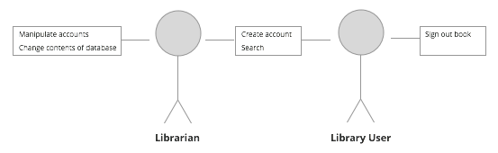

Assignment 1
=============

*Due October 2, 2014*

######Ben Tranter | CS 3415 | Assignment 1 | bwtrante@lakeheadu.ca

##Description
You are asked to do some requirement development. Suppose you are asked to develop a booking system for a public library system. The system is not necessarily online.

1. Define a possible scope for the system. First list a wide range of things that the system could do. Then narrow down the scope by selecting the most important features that you would implement in the first release of the system. Then give a precise problem statement for the system.

2. Identify stakeholders of the system. Select one important stakeholder and design a list of questions for interviewing that stakeholder.

3. Give functional requirements and quality requirements of the system.

4. Create a list of use cases and describe two of them in detail using the method discussed in class (two-column method). Then draw use cases diagram to describe the system. Indicate extension, generalization and inclusion, if there are any.

##Solutions
####1. System Scope
Here are some things I think the system could do:
- Provide a database containing every book, with a system to manage it
- Give the librarian administrative privileges
- Allow librarian to send notifications to users
- Allow librarian to add new books into the database
- Allow librarian to remove books from database
- Allow librarian to blacklist users who abuse library system
- Provide API so that apps maybe be created from the database info
- Allow users to search for availability of books through the system
- Manage the exchange of books
  - Check in books
  - Check out books
- Allow new users to sign up
- Allow users to add profile information
- Allow users to recover lost library cards
- Recommend books and other material to the user based on their borrowing history
- Send the users emails and notifications (promotional, reminders on books that are due, etc)

*Most Important Features*: In my opinion, these are the essential features:
- Provide the database - without the DB, none of the other features can exist
- Simple user system - without a user system, library cards cannot be assigned, books cannot be signed in/out, etc
- Search feature - this would make the library users experience exponentially easier

**Problem Statement**: The system will allow for books to indexed in searchable database, signed in and out by users, and administered by the librarian.

####2. Stakeholders

######Users
The users would be anyone who uses the public library system, as well as the librarian who works for the library.

######Customers
The customers would be any public library who wishes to implement this system.

######Developers
Based on the scope of this project, the likely developers would be:
- Database developer - responsible for the implementation of the database as well as all the data
- Back-end developer - responsible for implementing the database queries, the search functionality, and the logic which sends the data from the database to the user-interface
- Front-end developer - responsible for implementing the user interface. This means implementing the design, event handling, views, etc.
- Designer - responsible for designing the layout, styles, and templates for the different views of the application (like the search view, user sign-uo view, etc)

######Managers
- Since the team is relatively small in this case, the manager would have to ensure that the project stays on schedule, delivers all features, and is of sufficient quality. They would also need some prior experience in managing a database-driven software project.

####3. Functional & Quality Requirements

######Functional
- Any search queries must either return results or a "no results found message"
- User system must require a username and password, or throw an error
- User system must have a password recovery system
- Admin view must have options for manipulating the content of the database
- Database must be replicated and backed up in case of failure, to prevent data loss (this could also be considered a quality requirement)
- **Serahcing must allow searching by author, title, ISBN number, publisher, publication date, etc**

Since a large percentage of the library users are part of a more elderly population, considerations would have to be made for accessibility, such as:
- Large text
- Easy-to-use user interface

Optional Features for Accessibility
- Screen reader support
- Text-to-speech assistance
- Translation-ready (application may be used in other languages)

#####Quality Requirements
- Minimal downtime - since the entire functionality relies on the database being available, downtime during peak library hours would not be acceptable
- Fast search queries - the application will be used frequently for searching, so the queries must return results almost instantly
- As previously mentioned, database must be replicated and backed up in case of failure
- User system must return appropriate error messages in case of errors, and the program must not crash upon encountering an error

####4. Use Cases

Some use cases would be:
- searching
- signing up
- singing out a book
- administering the system
- adding a book to the database
- removing a book from the database

#####Use Case: Search

Related use cases:
*Generalization of*
- Search by title
- Search by author
- Search by ISBN
- Search by genre
- Search by publisher
- Search by publication date

Users:
- All users (general)

**Steps**

| User Actions                  | System Responses                          |
|-------------------------------|-------------------------------------------|
| 1. Navigate to "Search" field | 2. Show blinking cursor in "Search" field |
|                               | 3. Prompt user for input                  |
| 4. Enter search terms         | 5. Query database                         |
|                               | 6. Display results to user                |

#####Use Case: Change the contents of the database

Related use cases:
*Generalization of*
- Add a new book
- Remove a book that no longer exists
- Update info about an existing book

Users: Librarian only

**Steps**

| User Actions                  | System Responses                          |
|-------------------------------|-------------------------------------------|
| 1. Click the "modify database contents button" | 2. Prompt user to choose an action (create, update, or remove) |
| 3. Select option              | 4. Prompt user to select a title, or prompt user to enter a new title           |
| 5. Make a selection           | 6. Update database                       |
|                               | 7. Display results to user (either a success message or an error message)       |

